# SKN24-4th-3Team

---

> AI를 활용한 건설 현장 TBM 자동화 및 안전 관리 플랫폼 개발  
> **프로젝트 기간: 2026.04.30 / 2026.05.04 (2일)**

# 1. 팀 소개

## 팀명: DataBuilders (데이터빌더스)
<strong>'현장의 안전 데이터를 하나씩 쌓아 올리는 사람들'<strong>이라는 의미의 팀명입니다.

## 팀원 소개
 
| 김규호 | 박수영 | 박세현 | 이동민 | 최하진 |
| :---: | :---: | :---: | :---: | :---: |
|  |  |  |  |  |
|  |  |  |  |  |
> AI로 생성된 이미지입니다.

## 2. 프로젝트 개요 📑

### **2.1 프로젝트 명**
**HelpMet (헬프멧)** : Help (도움) + Helmet (안전모)  
헬멧이 머리를 지키듯, 우리는 현장의 안전을 지킨다는 의미를 담고 있습니다.

## 2-2 프로젝트 소개

**"현장 중심의 안전 활동을 디지털로 전환하는 AI TBM 비서"**

* **TBM(Tool Box Meeting)이란?** 
  작업 직전, 현장 근처에서 관리감독자를 중심으로 작업자들이 모여 오늘의 작업 내용과 위험요인, 안전한 작업 방법을 서로 확인하고 공유하는 핵심 안전 활동입니다.
* **AI 기반 TBM 초안 작성 서비스** 
  고용노동부가 TBM 기록을 안전교육 시간으로 인정함에 따라, HelpMet은 STT(음성인식)와 AI를 활용해 TBM 내용을 자동으로 정리하고 일지 초안을 생성합니다.
* **RAG 기반 기술지원규정(KOSHA GUIDE) 챗봇** 
  한국산업안전보건공단의 기술지원규정(KOSHA GUIDE)을 기반으로 작업별 위험요인과 안전수칙을 안내합니다. 현장소장은 복잡한 안전 지침을 직접 검색하지 않아도, 챗봇을 통해 TBM 진행에 필요한 안전 정보를 빠르게 확인할 수 있습니다.

> **출처:** [고용노동부] [작업 전 안전점검회의(TBM) 활성화를 위한 안전교육 인정](https://www.moel.go.kr/news/enews/report/enewsView.do?news_seq=16488)

---

## 2-3 프로젝트 필요성 및 배경

### ( 1 ) 프로젝트 배경 - 중대재해처벌법 확대와 소규모 현장의 부담

  

2024년 1월부터 **중대재해처벌법이 5인 이상 50인 미만 사업장까지 확대 적용**되면서, 소규모 건설 현장도 사고 발생 시 경영책임자의 법적 책임에서 자유롭기 어려워졌습니다. 

그러나 공사금액 50억 원 미만 건설 현장은 전담 안전관리자 선임 의무가 면제되어 있어, 현장소장이나 관리자가 공정 관리, 인력 관리, 안전관리, 서류 작성까지 동시에 수행해야 하는 구조적 한계가 존재합니다. 이로 인해 실질적인 사고 예방 활동보다 형식적인 문서 작업에 치우칠 가능성이 높으며, 현장에 맞는 현실적인 안전관리 지원 도구가 절실한 상황입니다.

---

### ( 2 ) 현장의 문제점 1 - 과도한 안전 서류 업무

  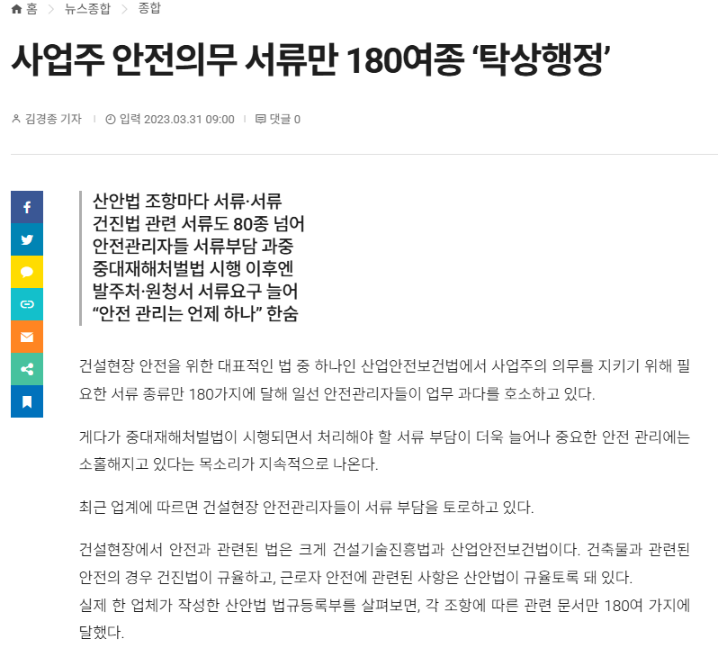

건설 현장에서는 산업안전보건법, 중대재해처벌법, 위험성평가, 안전교육, 각종 점검 대응 등으로 인해 방대한 종류의 안전 관련 서류가 요구됩니다. 실제 현장에서는 서류 작성과 점검 대응에 많은 시간을 빼앗겨, 정작 중요한 **사고 예방 활동과 근로자 안전 소통에 집중하기 어려운 모순**이 발생합니다. 

HelpMet은 매일 반복되는 TBM 일지 작성을 AI로 보조하여, 관리자가 현장 위험요인 확인과 작업자 안전교육이라는 본연의 임무에 더 집중할 수 있도록 돕습니다.

> **출처:** > * [대한전문건설신문] [사업주 안전의무 서류만 180여종 '탁상행정'](https://www.koscaj.com/news/articleView.html?idxno=234208)
> * [문화일보] [최대 '1년에 한달꼴'… 건설업 발목잡는 '중복 안전점검'](https://www.munhwa.com/article/11448576)

---

### ( 3 ) 현장의 문제점 2 - 정보 접근성 및 고령화된 현장의 한계

  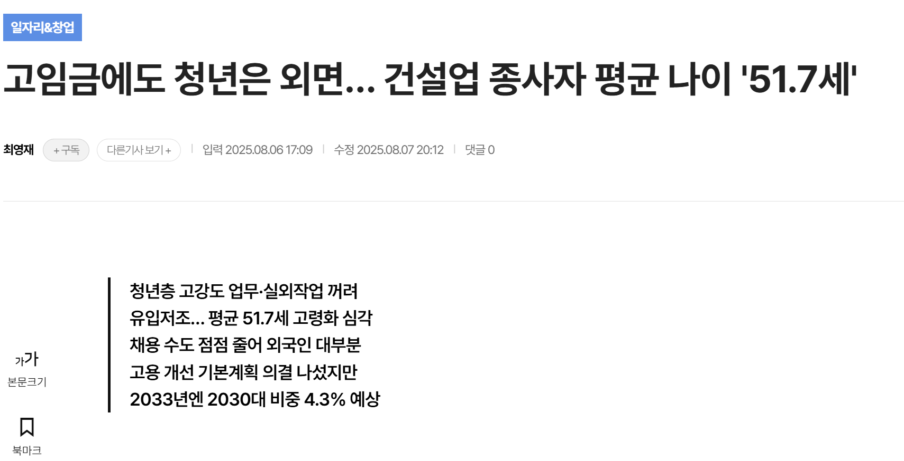

* **안전 지침 검색과 해석의 어려움:** 건설 현장은 비계, 굴착, 고소, 전기, 중장비 등 공정별 위험요인이 매우 다양합니다. 현장소장이 KOSHA GUIDE와 같은 방대한 기술지침을 직접 검색 및 공부하여 현장 상황에 맞게 해석하여 적용하기에는 시간과 전문성의 한계가 따릅니다.
* **고령화된 현장의 디지털 장벽:** 건설업 현장의 고령화 추세를 고려할 때, 복잡한 대시보드나 다단계 메뉴, 긴 텍스트 입력을 요구하는 시스템은 실제 현장 적용성이 크게 떨어집니다.

---

### ( 4 ) 해결의 실마리 - TBM의 법적·실무적 중요성

  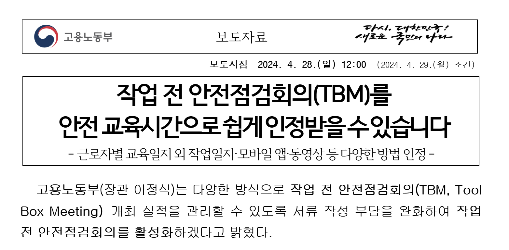

고용노동부는 작업 전 안전점검회의(TBM)를 안전보건 정기교육 시간으로 인정하고 있으며, 애플리케이션이나 동영상 등 다양한 방식의 전산 기록도 유효한 것으로 인정하고 있습니다. 

따라서 TBM은 단순한 아침 조회가 아니라, **법정 안전교육 의무 이행과 현장 중심 사고 예방을 동시에 달성할 수 있는 가장 효율적인 안전 활동**입니다. HelpMet은 이러한 TBM 내용을 자동으로 기록하고, 작업별 위험요인과 안전대책을 연결하여 제도의 실효성을 극대화합니다.

> **출처:** [고용노동부] [작업 전 안전점검회의(TBM) 활성화를 위한 안전교육 인정](https://www.moel.go.kr/news/enews/report/enewsView.do?news_seq=16488)

### ( 5 ) 해결의 실마리 2 - 이미 다양한 스마트 안전관리 서비스의 존재 및 기존 서비스의 한계와 HelpMet의 당위성

  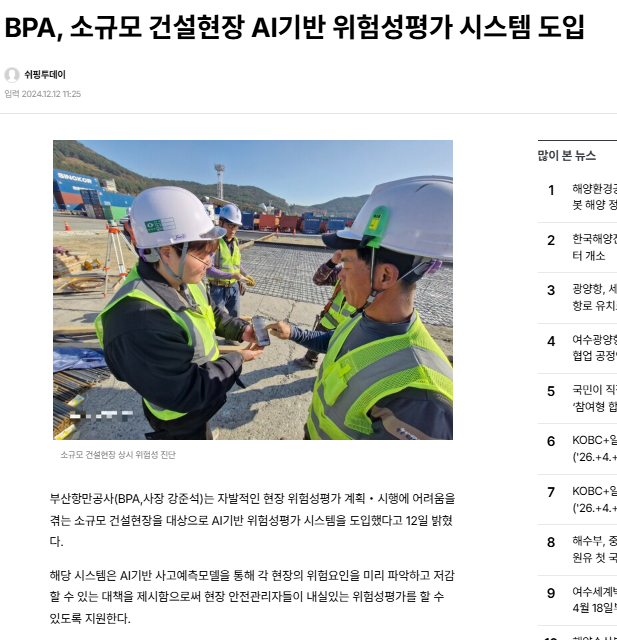
   
  실제 현장에서 AI기반 사고예측모델을 통해 현장의 위험요인을 미리 파악

실제 현장에서는 AI를 도입하여 현장을 관리합니다.

현재 건설 안전 시장에는 다양한 스마트 솔루션들이 존재하지만, 소규모 현장의 실질적인 고충을 해결하기에는 여전히 높은 장벽이 존재합니다.

  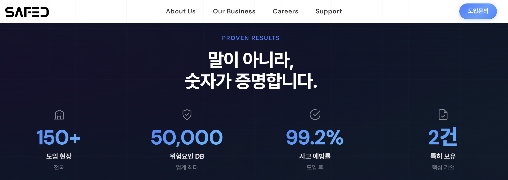
  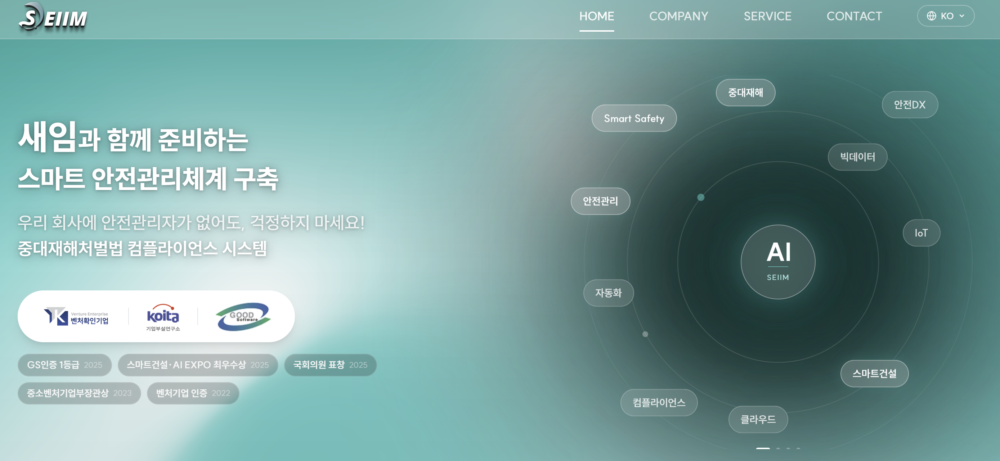
   
  <em>[참고 1] SAFED & 페이퍼리: 본사 관리자 중심의 고도화된 안전관리 시스템</em>

가장 대표적인 서비스인 <storng>세이프디(SAFED)<storng>와 <storng>페이퍼리(Paiperly)<storng>는 50,000건 이상의 방대한 위험 요인 DB를 보유하고 있으며, 안전 현황 보고서를 매우 체계적으로 관리합니다. 
하지만 이러한 서비스들은 기본적으로 **'본사 모니터링' 중심의 구조**로 설계되어 있습니다. 전담 안전관리자가 없는 소규모 현장에서는 현장소장이 본사 관리자의 역할까지 수행하며 복잡한 대시보드를 직접 운영해야 하므로, IT 기기에 익숙하지 않은 고령의 소장님이 다루기에 인터페이스가 무겁고 도입 비용 또한 큰 부담으로 작용합니다.

---

  
  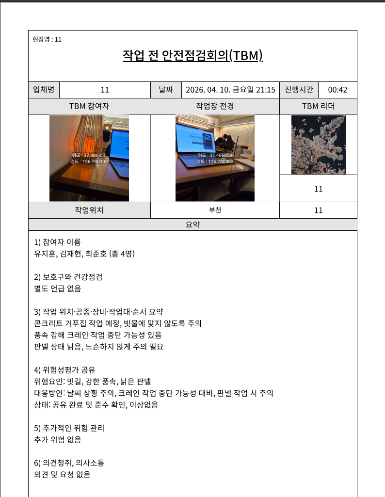
   
  <em>[참고 2] 기존 TBM AI 서비스: 단순 녹음 기반의 초안 작성 방식</em>

최근 등장한 **TBM AI 서비스**들은 음성 인식(STT)을 통해 회의 초안을 작성해준다는 점에서 소규모 현장의 접근성을 높였으나, 기능적 한계가 명확합니다. 단순히 녹음 내용을 텍스트로 변환하는 수준에 그쳐 생성된 일지의 형식이 너무 간단하며, 실제 법적 증빙이나 정교한 안전 교육 자료로 활용하기에는 내용의 깊이가 부족합니다.

> **출처:**
> * [1] [SAFED: 데이터 기반 스마트 안전관리 플랫폼](https://www.safed.kr/)
> * [2] [페이퍼리: 건설 현장 안전관리 업무 자동화 솔루션](https://www.paiperly.com/)
> * [3] [TBM AI: 인공지능 기반 TBM 일지 작성 서비스](https://tbmai.co.kr/)

## 2-4 프로젝트 목표

- **TBM 일지 작성 자동화:**  음성 인식(STT) 기술을 활용하여 TBM 내용을 자동으로 텍스트화합니다. AI가 회의 내용을 바탕으로 작업 내용, 위험요인, 안전대책, 참석자 건강이상, 날씨 등을 정리해 일지 초안을 생성함으로써 서류 작성 부담을 획기적으로 줄입니다.
- **RAG 기반 KOSHA GUIDE 안전 챗봇 제공:**  KOSHA GUIDE를 기반으로 사용자가 작업 상황을 질문하면 관련 안전 지침을 검색하여 현장에서 이해하기 쉬운 형태로 답변합니다. 복잡한 지침을 직접 찾지 않아도 즉각적인 안전 정보 확보가 가능합니다.
- **소규모 건설 현장에 적합한 쉬운 사용성 제공:**   복잡한 대시보드 대신 음성 입력과 챗봇 질의응답 중심의 직관적인 UI를 모바일 환경에 맞게 제공하여, IT 기기에 익숙하지 않은 고령의 관리자도 쉽게 사용할 수 있도록 설계합니다.

# 3. 기술 스택 & 사용 모델 (Tech Stack & Models)

<table>
  <thead>
    <tr>
      <th style="text-align:center;">분류</th>
      <th style="text-align:center;">기술 스택 & 모델</th>
    </tr>
  </thead>
  <tbody>
    <tr>
      <td align="center"><b>Backend</b></td>
      <td>
        
        
      </td>
    </tr>
    <tr>
      <td align="center"><b>AI / RAG</b></td>
      <td>
        
        
        
        
      </td>
    </tr>
    <tr>
      <td align="center"><b>Database</b></td>
      <td>
        
        
      </td>
    </tr>
    <tr>
      <td align="center"><b>Infrastructure / Deployment</b></td>
      <td>
        
        
        
        
        
      </td>
    </tr>
    <tr>
      <td align="center"><b>External Service</b></td>
      <td>
        
        
      </td>
    </tr>
    <tr>
      <td align="center"><b>Collaboration</b></td>
      <td>
        
        
        
      </td>
    </tr>
  </tbody>
</table>

## 4. 시스템 구성도
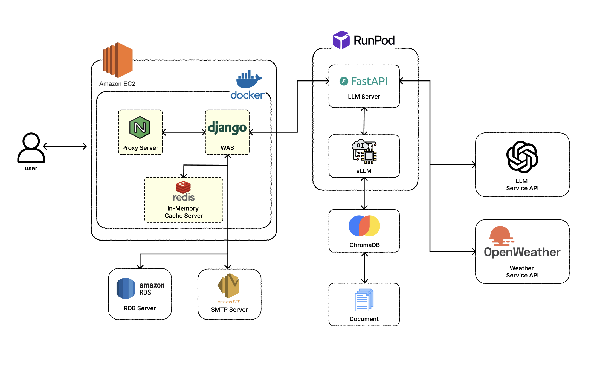

## 5. 요구사항 정의서
**● 회원관리**
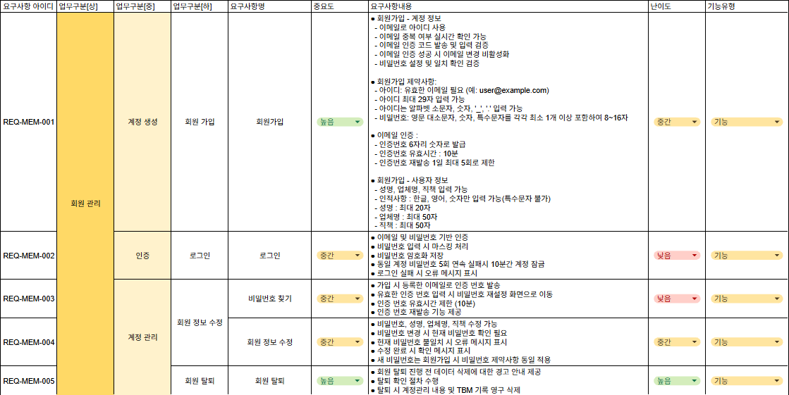
 
**● TBM - 기록작성**
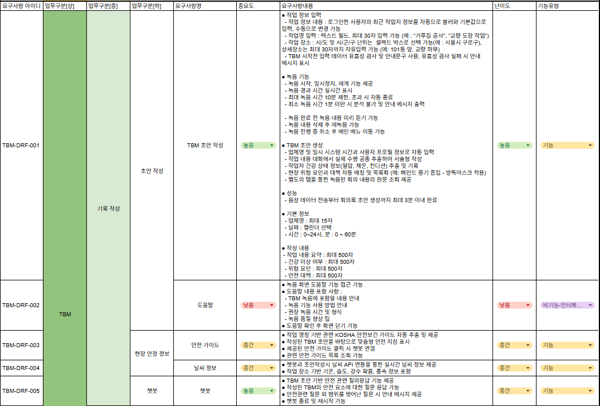
 
**● TBM - TBM 조회**
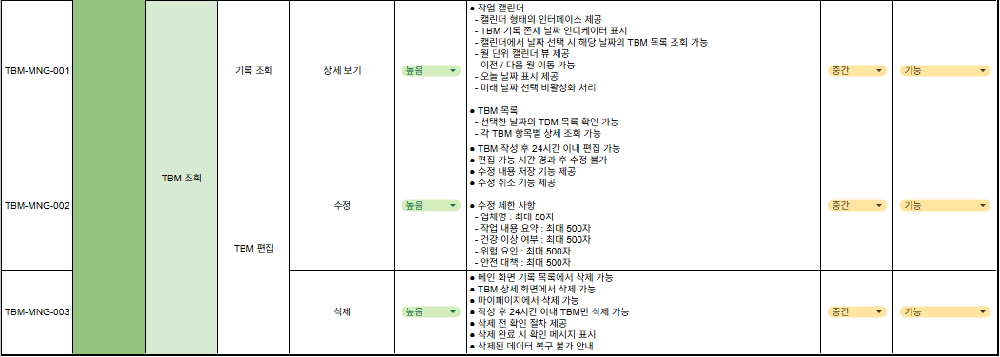

## 6. 화면설계서

**●  메인 대시보드**

**●  TBM 작성 - 녹음시작**

**●  TBM 작성 - 초안확인**

**●  챗봇**
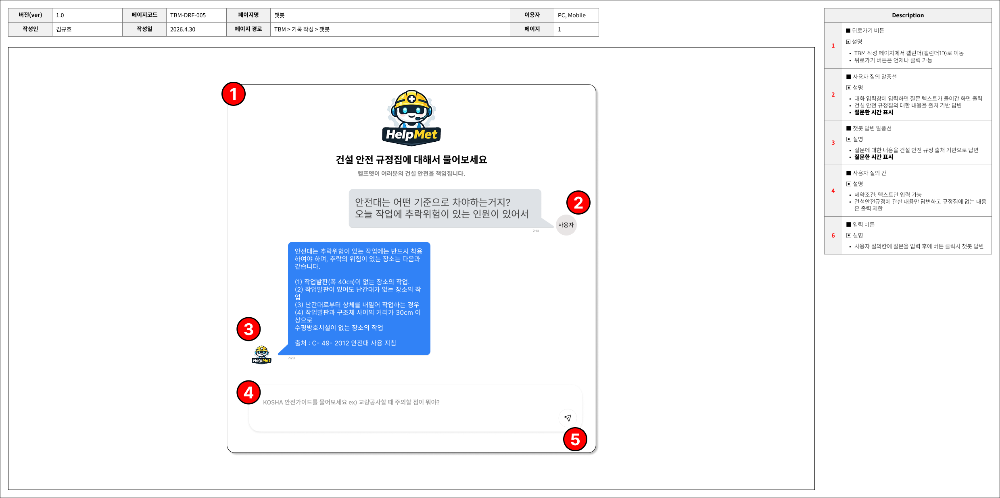

**●  화면 설계서**
[화면설계서 PDF](https://github.com/SKNETWORKS-FAMILY-AICAMP/SKN24-4th-3Team/tree/main/docs/screen_design)

## 7. WBS

## 8. 테스트 계획 및 결과 보고서
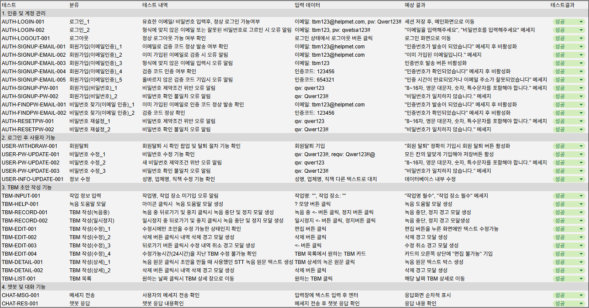

## 9. 수행결과 (테스트/시연 페이지)

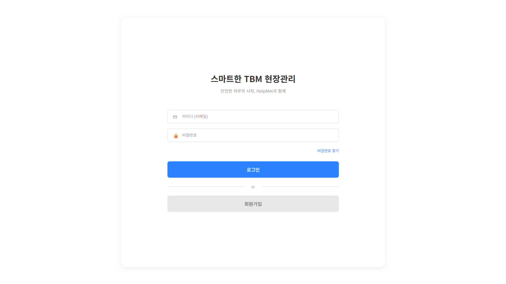
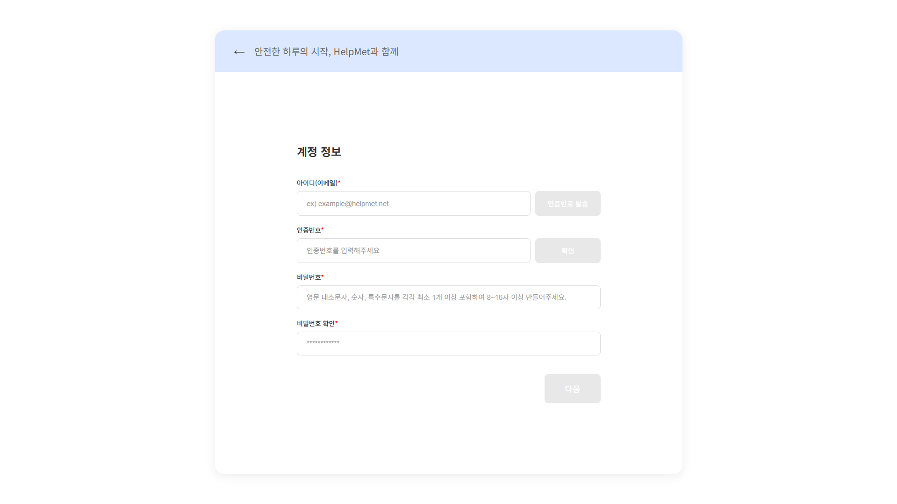
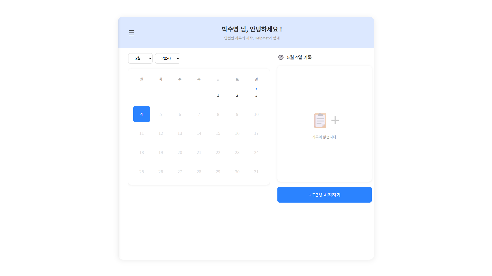
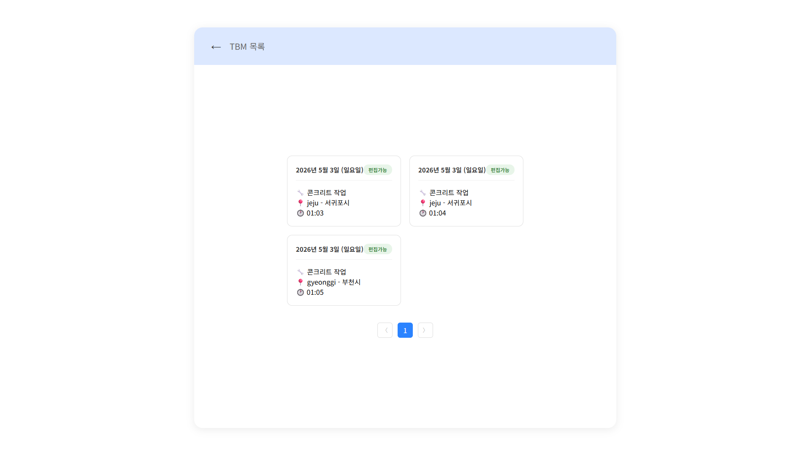
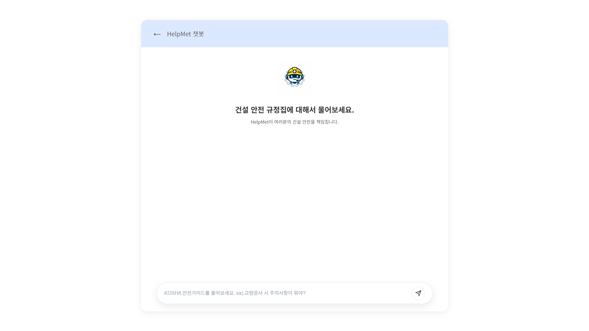
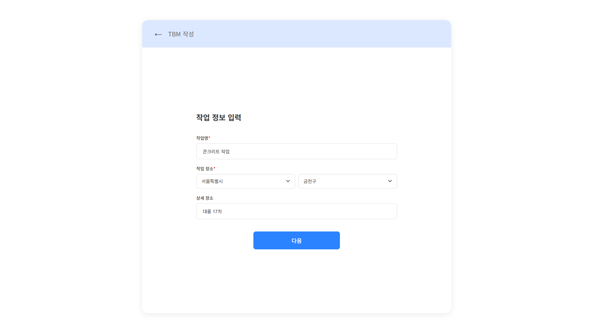
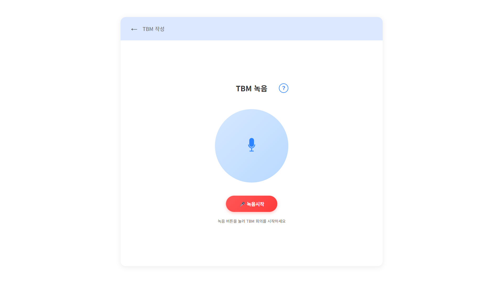
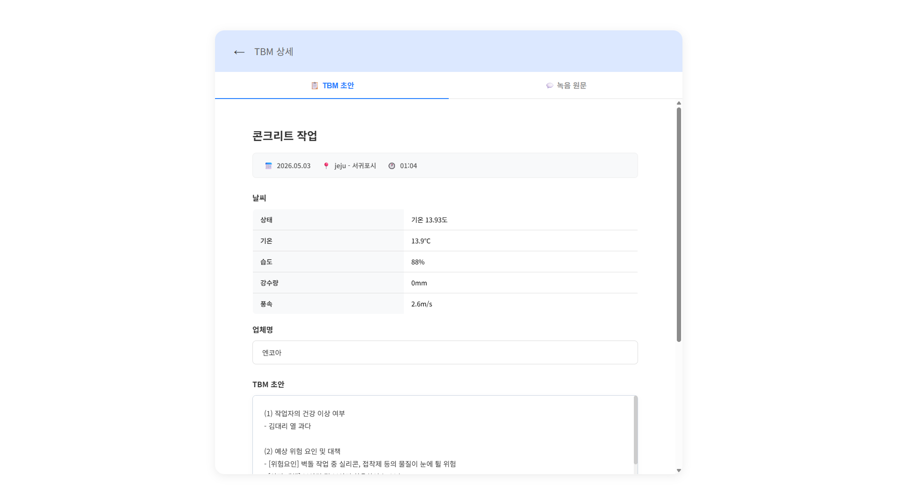
- **배포 링크:** [[AI를 활용한 건설 현장 TBM 자동화 및 안전 관리 플랫폼](http://3.38.36.204/)]

## 10. 한 줄 회고
| 이름 | 한 줄 회고 |
| :------- | :--- |
| **김규호** | K: 팀원들과의 생산성 있는 토론과 회의, 배포한 서비스를 계속 시도하면서 불편한 UI, UX 변경   P: AWS, RDS 사용시 확립되지 않는 내용들을 사용해 내가 뭘 사용했는지 잊는 경우 발생, 요구사항명세서 및 화면설계서의 많은 시간 소비   T: 생산성이 있는 토론, 회의를 빠르게 끝날 수 있는 방법 연구, AWS에 있는 기능 활용성 높히기| 
| **박수영** |Django를 통해 뼈대를 만들고 EC2를 통해 서버를 구현하면서, 서버관리가 생각보다 까다롭다고 생각했다. 아무것도 없는 환경이었기 때문에 pem이나 ssh로 연결하여 관리하는 것이 생소하였기 때문이다. docker를 처음 사용해보며 이론적으로 배운 개념을 넘어서 실제로 왜 docker를 사용하는지 직접 구현해보며 깨달았다. DB 또한 RDS를 연결할 때, DB 테이블이 어떻게 생기는 건지 궁금했는데, Django의 models.py를 이용하는 것을 직접 배웠다. |
| **박세현** | AWS를 많이 써볼 수 있어서 좋았다. 평소에 이름을 많이 들어봤지만 실제로 써볼 기회가 많이 없었다. 이번 기회에 AWS를 최대한 써보려고 했다. EC2, S3, RDS, SES, 등을 연동해보았다. 그 과정에서 필요한 IAM, 리전, VPC 등 AWS 개념도 함께 익힐 수 있었다. |
| **이동민** | 이번 프로젝트를 통해 Django 기반 웹 서비스 구현뿐만 아니라 협업의 중요성을 배울 수 있었다. 기능이 서로 연결되어 있어 팀원 간 진행 상황 공유와 코드 통합 과정이 매우 중요했다..이번 경험을 바탕으로 앞으로는 기능 구현뿐만 아니라 팀원 간 소통, 문서 관리, 테스트 결과 정리까지 함께 고려하며 더 완성도 높은 프로젝트를 진행하겠다.|
| **최하진** | 요구사항 정의서부터 설계, 프론트·백엔드까지 직접 분업하고 소통하면서 협업이 얼마나 중요한지 몸으로 느꼈다. HTML이랑 Django를 연결하면서 하나 고치면 또 다른 게 터지고 그런 과정들이 있었는데, 하나씩 해결하다 보니 오류 찾는 것도 점점 빨라졌다. 서버는 처음 접해봐서 아직 모르는 게 많다고 느꼈고, 앞으로 더 배워나가야겠다는 동기부여가 됐다.|
