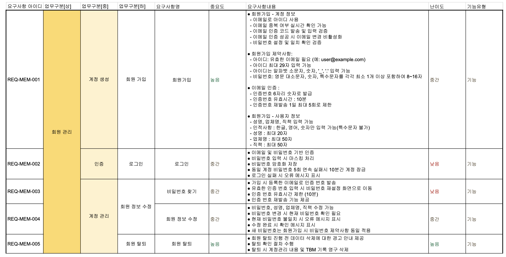
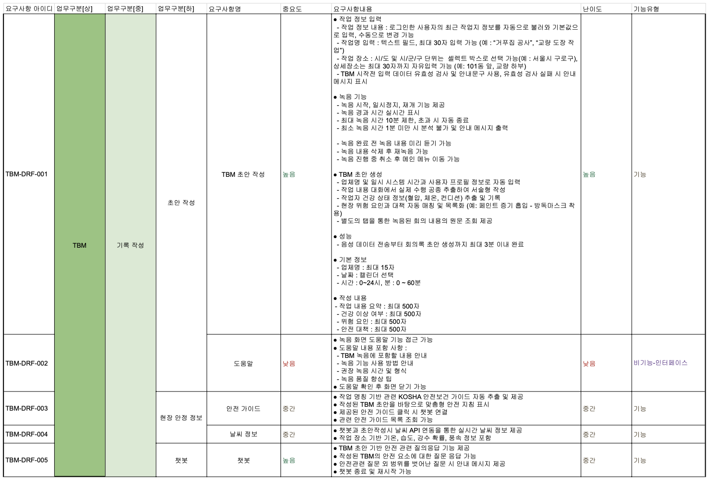
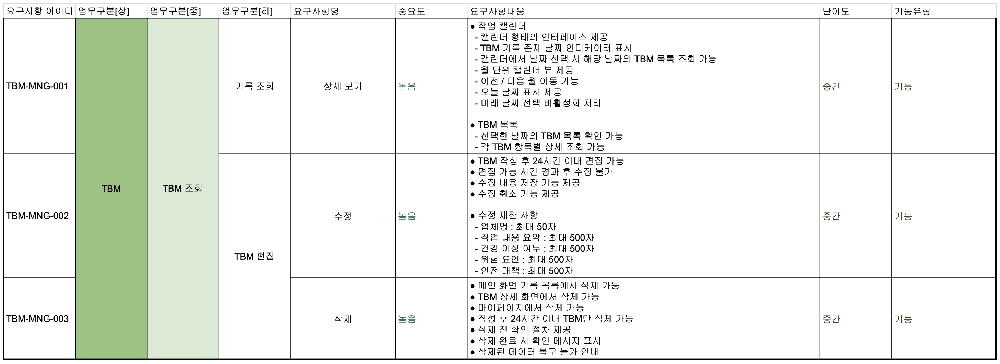
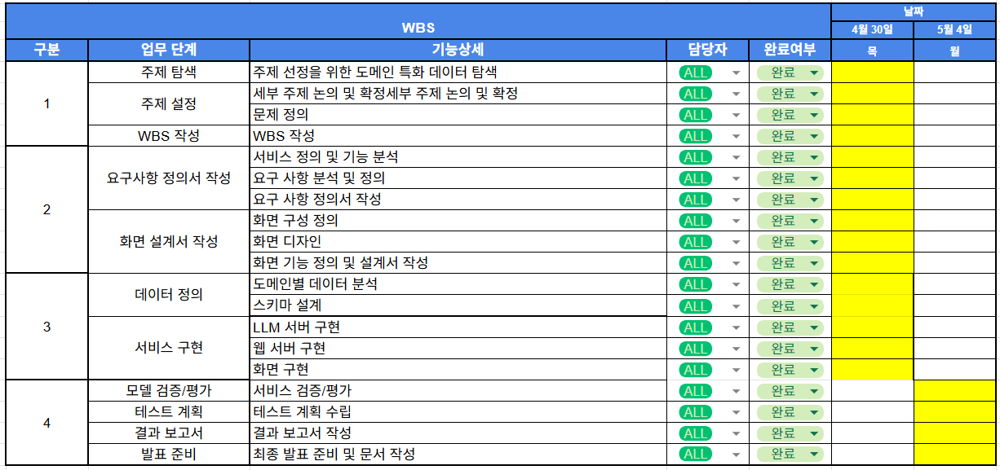

# SKN24-4th-3Team

---

> AI를 활용한 건설 현장 TBM 자동화 및 안전 관리 플랫폼 개발  
> **프로젝트 기간: 2026.04.30 / 2026.05.04 (2일)**

# 1. 팀 소개

## 팀명: DataBuilders (데이터빌더스)
<strong>'현장의 안전 데이터를 하나씩 쌓아 올리는 사람들'<strong>이라는 의미의 팀명입니다.

## 팀원 소개
 
| 김규호 | 박수영 | 박세현 | 이동민 | 최하진 |
| :---: | :---: | :---: | :---: | :---: |
|  |  |  |  |  |
|  |  |  |  |  |
> AI로 생성된 이미지입니다.

## 2. 프로젝트 개요 📑

### **2.1 프로젝트 명**
**HelpMet (헬프멧)** : Help (도움) + Helmet (안전모)  
헬멧이 머리를 지키듯, 우리는 현장의 안전을 지킨다는 의미를 담고 있습니다.

### **2.2 프로젝트 소개**
**"현장 중심의 안전 활동을 디지털로 전환하는 AI TBM 비서"**

*   **TBM(Tool Box Meeting)이란?**
    *   작업 직전, 현장 근처에서 관리감독자를 중심으로 작업자들이 모여 오늘의 작업 내용과 위험요인, 안전한 작업 방법을 서로 확인하고 공유하는 핵심 안전 활동입니다.
*   **AI 기반 TBM 초안 작성 서비스**
    *   고용노동부가 애플리케이션, 동영상 등 다양한 방식의 TBM 기록을 인정함에 따라, HelpMet은 STT와 AI를 활용해 TBM 내용을 자동으로 정리하고 일지 초안을 생성합니다.
*   **RAG 기반 기술지원규정(KOSHA GUIDE)기반 챗봇**
    *   한국산업안전보건공단의 기술지원규정(KOSHA GUIDE)을 기반으로 작업별 위험요인과 안전수칙을 안내합니다.
    *   현장소장은 복잡한 안전 지침을 직접 검색하지 않아도, 챗봇을 통해 TBM 진행에 필요한 안전 정보를 빠르게 확인할 수 있습니다.
> **출처:** [고용노동부 보도자료: 작업 전 안전점검회의(TBM) 활성화를 위한 안전교육 인정](https://www.moel.go.kr/news/enews/report/enewsView.do?news_seq=16488)

### **2.3 프로젝트 필요성 및 배경**

* **중대재해처벌법 확대와 소규모 현장의 안전관리 부담 증가**
  * 2024년 1월부터 중대재해처벌법이 5인 이상 50인 미만 사업장까지 확대 적용되면서, 소규모 건설 현장도 사고 발생 시 경영책임자의 법적 책임에서 자유롭기 어려워졌습니다.
  * 그러나 공사금액 50억 원 미만 건설 현장은 전담 안전관리자 선임 의무가 면제되어 있어, 현장소장이나 관리자가 공정 관리, 인력 관리, 안전관리, 서류 작성까지 동시에 수행해야 하는 구조적 한계가 있습니다.
  * 이로 인해 소규모 현장에서는 실질적인 사고 예방 활동보다 형식적인 문서 작업에 치우칠 가능성이 높으며, 현장에 맞는 현실적인 안전관리 지원 도구가 필요합니다.
* **과도한 안전 서류 업무로 인한 현장 안전관리 약화**
  * 건설 현장에서는 산업안전보건법, 중대재해처벌법, 위험성평가, 안전교육, 각종 점검 대응 등으로 인해 다양한 안전 관련 서류가 요구됩니다.
  * 실제 현장에서는 안전관리자가 서류 작성과 점검 대응에 많은 시간을 사용하게 되어, 정작 중요한 사고 예방 활동과 근로자 안전 소통에 집중하기 어려운 문제가 발생합니다.
  * HelpMet은 매일 반복되는 TBM 일지 작성과 안전교육 기록 업무를 AI로 보조하여, 관리자가 현장 위험요인 확인과 작업자 안전교육에 더 집중할 수 있도록 돕습니다.
* **TBM의 법적·실무적 중요성 증가**
  * 고용노동부는 작업 전 안전점검회의(TBM)를 안전보건 정기교육 시간으로 인정하고 있으며, 애플리케이션, 동영상 등 다양한 방식의 TBM 기록도 인정하고 있습니다.
  * 따라서 TBM은 단순한 아침 회의가 아니라, 법정 안전교육 의무 이행과 현장 중심 사고 예방을 동시에 달성할 수 있는 중요한 안전 활동입니다.
  * HelpMet은 TBM 내용을 자동으로 기록하고, 작업별 위험요인과 안전대책을 함께 정리함으로써 TBM의 실효성을 높입니다.
* **안전 지침 검색과 해석의 어려움**
  * 현장소장은 작업별 위험요인과 안전수칙을 확인해야 하지만, KOSHA GUIDE와 같은 안전보건 기술지침을 직접 검색하고 현장 상황에 맞게 해석하는 데 어려움을 겪을 수 있습니다.
  * 건설 현장은 비계 작업, 굴착 작업, 고소 작업, 전기 작업, 중장비 작업 등 공정별 위험요인이 다양하기 때문에, 작업 상황에 맞는 안전 정보를 빠르게 제공하는 시스템이 필요합니다.
  * HelpMet의 RAG 기반 KOSHA GUIDE 안전 챗봇은 사용자의 질문에 따라 관련 안전 지침을 검색하고, 현장에서 이해하기 쉬운 형태로 작업별 위험요인과 안전수칙을 안내합니다.
* **고령화된 건설 현장의 디지털 장벽**
  * 건설업 현장은 고령화가 진행되고 있어 복잡한 대시보드, 긴 텍스트 입력, 다단계 메뉴 중심의 시스템은 실제 현장 적용성이 떨어질 수 있습니다.
  * HelpMet은 음성 인식 기반 TBM 작성과 챗봇 질의응답 방식을 통해, 사용자가 복잡한 기능을 학습하지 않아도 필요한 안전 정보를 쉽게 얻을 수 있도록 설계합니다.

> **출처:**  
> [고용노동부 보도자료: 작업 전 안전점검회의(TBM) 활성화를 위한 안전교육 인정](https://www.moel.go.kr/news/enews/report/enewsView.do?news_seq=16488)  
> [대한전문건설신문: 사업주 안전의무 서류만 180여종 '탁상행정'](https://www.koscaj.com/news/articleView.html?idxno=234208)  
> [문화일보: 최대 '1년에 한달꼴'… 건설업 발목잡는 '중복 안전점검'](https://www.munhwa.com/article/11448576)
### **2.4 프로젝트 목표**
* **TBM 일지 작성 자동화**
  * 음성 인식(STT) 기술을 활용하여 작업 전 안전점검회의(TBM) 내용을 자동으로 텍스트화합니다.
  * AI가 회의 내용을 바탕으로 작업 내용, 위험요인, 안전대책, 참석자 정보 등을 정리하여 TBM 일지 초안을 생성합니다.
  * 이를 통해 현장소장과 관리감독자의 반복적인 서류 작성 부담을 줄입니다.
* **RAG 기반 KOSHA GUIDE 안전 챗봇 제공**
  * 한국산업안전보건공단의 기술지원규정(KOSHA GUIDE)을 기반으로 건설 안전 분야의 작업별 위험요인과 안전수칙을 안내합니다.
  * 사용자가 작업 상황을 질문하면 관련 안전 지침을 검색하고, 현장에서 이해하기 쉬운 형태로 답변합니다.
  * 이를 통해 현장소장이 복잡한 안전 지침을 직접 검색하지 않아도 필요한 안전 정보를 빠르게 확인할 수 있도록 합니다.
* **위험성평가와 TBM 기록의 연계**
  * TBM 내용에서 주요 작업, 위험요인, 예방대책을 추출하여 위험성평가에 활용할 수 있는 형태로 정리합니다.
  * 작업 전 공유된 안전수칙과 위험요인을 기록으로 남겨, 안전교육 이행 자료로 활용할 수 있도록 합니다.
  * 단순한 회의 기록이 아니라, 현장 안전관리 자료로 재사용 가능한 기록 체계를 구축합니다.

* **소규모 건설 현장에 적합한 쉬운 사용성 제공**
  * 복잡한 대시보드나 긴 텍스트 입력 대신, 음성 입력과 챗봇 질의응답 중심의 사용 흐름을 제공합니다.
  * 고령의 현장소장이나 IT 사용에 익숙하지 않은 사용자도 쉽게 TBM 작성과 안전 지침 검색을 수행할 수 있도록 설계합니다.
  * 모바일 환경에서도 현장 중심으로 빠르게 사용할 수 있는 UI를 제공합니다.
* **실질적인 현장 안전 소통 강화**
  * 당일 작업자가 반드시 알아야 할 위험요인과 안전수칙을 TBM 과정에서 쉽게 공유할 수 있도록 지원합니다.
  * 관리자와 근로자 간의 안전 소통을 활성화하여, 형식적인 서류 작성이 아닌 실제 사고 예방 중심의 안전 활동을 강화합니다.

# 3. 기술 스택 & 사용 모델 (Tech Stack & Models)

<table>
  <thead>
    <tr>
      <th style="text-align:center;">분류</th>
      <th style="text-align:center;">기술 스택 & 모델</th>
    </tr>
  </thead>
  <tbody>
    <tr>
      <td align="center"><b>Framework</b></td>
      <td>
        
        
        
      </td>
    </tr>
    <tr>
      <td align="center"><b>LLM & Embedding</b></td>
      <td>
        
        
      </td>
    </tr>
    <tr>
      <td align="center"><b>Database</b></td>
      <td>
        
        
      </td>
    </tr>
    <tr>
      <td align="center"><b>Infrastructure</b></td>
      <td>
        
        
        
      </td>
    </tr>
    <tr>
      <td align="center"><b>협업 & 형상 관리</b></td>
      <td>
        
        
        
      </td>
    </tr>
  </tbody>
</table>

## 4. 시스템 구성도

## 5. 요구사항 정의서
**● 회원관리**

 
**● TBM - 기록작성**

 
**● TBM - TBM 조회**

## 6. 화면설계서

## 7. WBS

## 8. 테스트 계획 및 결과 보고서

## 9. 수행결과 (테스트/시연 페이지)
* **시연 영상 또는 배포 링크:** [링크 입력]

## 10. 한 줄 회고
| 이름 | 한 줄 회고 |
| :--- | :--- |
| **김규호** | |
| **박수영** | |
| **박세현** | AWS를 많이 써볼 수 있어서 좋았다. 평소에 이름을 많이 들어봤지만 실제로 써볼 기회가 많이 없었다. 이번 기회에 AWS를 최대한 써보려고 했다. EC2, S3, RDS, SES, 등을 연동해보았다. 그 과정에서 필요한 IAM, 리전, VPC 등 AWS 개념도 함께 익힐 수 있었다. |
| **이동민** | |
| **최하진** | |
